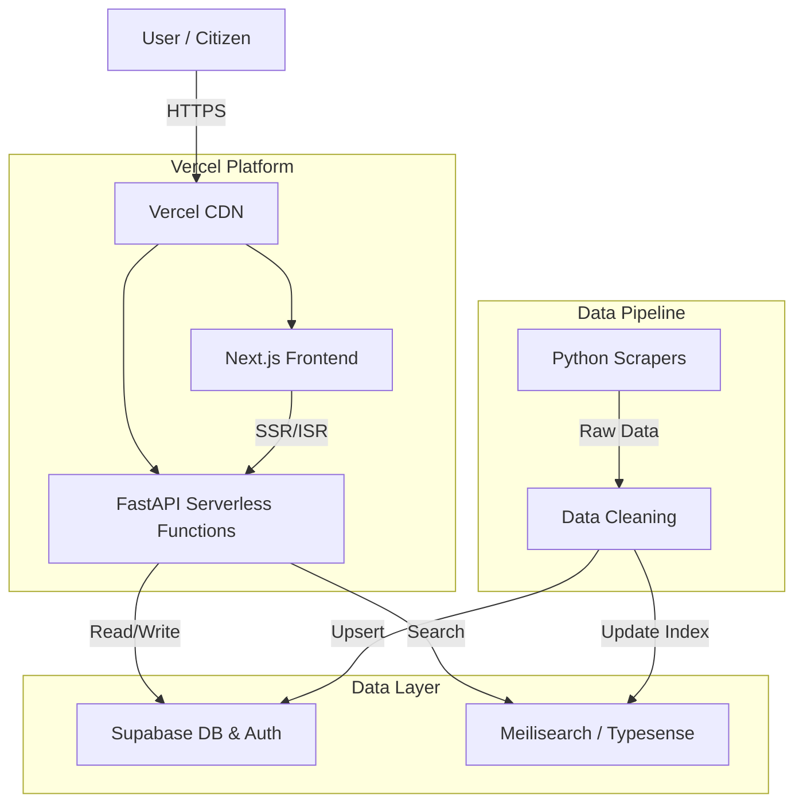

# SchemeSaarthi System Architecture

## High Level Architecture



## Component Details

### Frontend (Next.js)

- Hosted on Vercel.
- Uses server-side rendering (SSR) for SEO and initial load performance.
- Interacts with Supabase Auth for user session management.

### Backend (FastAPI on Vercel)

- Deployed as Vercel Serverless Functions using the Python runtime.
- Exposes REST endpoints for:
  - `/api/schemes`: Fetch and filter schemes.
  - `/api/eligibility`: Evaluate user eligibility against scheme rules.
  - `/api/user`: User profile and saved schemes management.

### Database (Supabase)

- **PostgreSQL**: Primary data store.
- **Row Level Security (RLS)**: Enforces access control.
- **Auth**: Manages user identities (Email/Password, OAuth).

### Search Engine

- **Meilisearch** (or Typesense): fast, typo-tolerant search for scheme titles and descriptions.
- Synced with Supabase updates.

## Search Index Schema

We will create a `schemes` index in Meilisearch with the following structure:

```json
{
  "id": "uuid",
  "title": "Pradhan Mantri Awas Yojana",
  "description": "Housing data...",
  "ministry": "Ministry of Housing",
  "state": "Central",
  "tags": ["housing", "subsidy", "finance"],
  "beneficiary_type": ["Individual", "Family"],
  "timestamp": 167888888
}
```

**Searchable Attributes:** `title`, `description`, `ministry`, `tags`
**Filterable Attributes:** `state`, `beneficiary_type`, `ministry`
